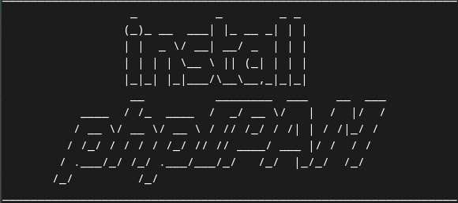
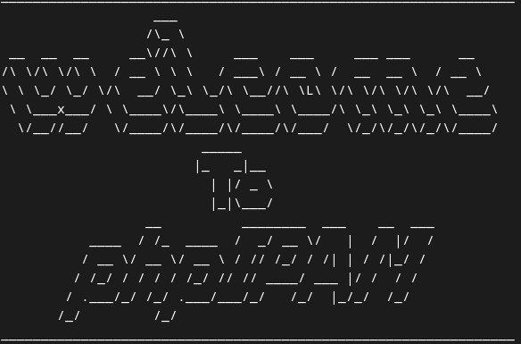

# phpIPAM Server

Tool to simplify intalation of phpIPAM Server

Execution command

- Install through wget

```shell
sh -c "$(wget https://raw.githubusercontent.com/rick0x00/srv_phpipam/master/os/debian/native/build.sh -O -)"
```

- Install through curl

```shell
sh -c "$(curl -fsSL https://raw.githubusercontent.com/rick0x00/srv_phpipam/master/os/debian/native/build.sh)"

```



